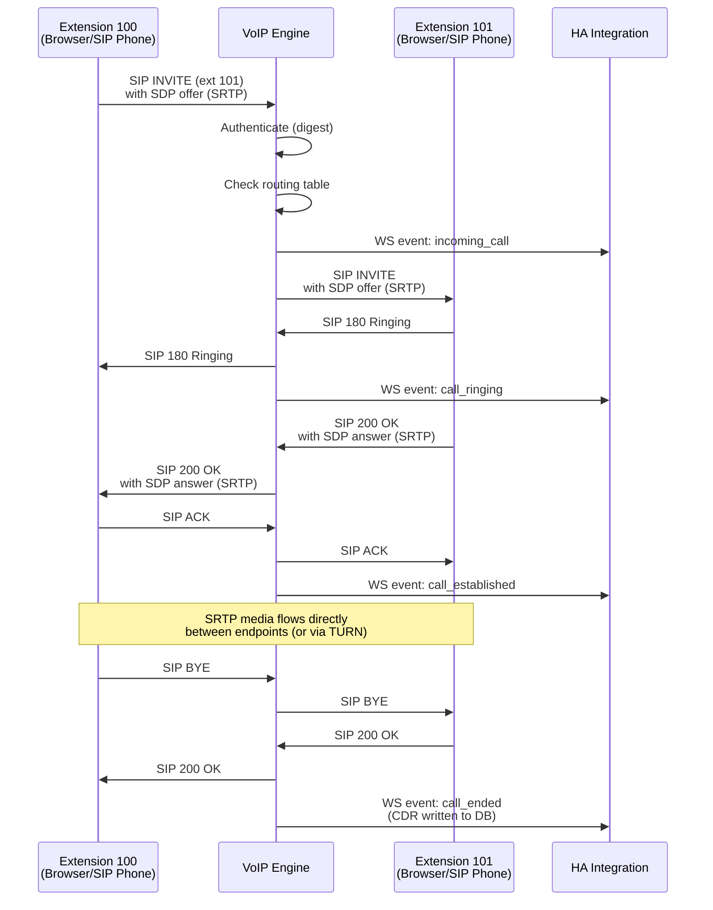
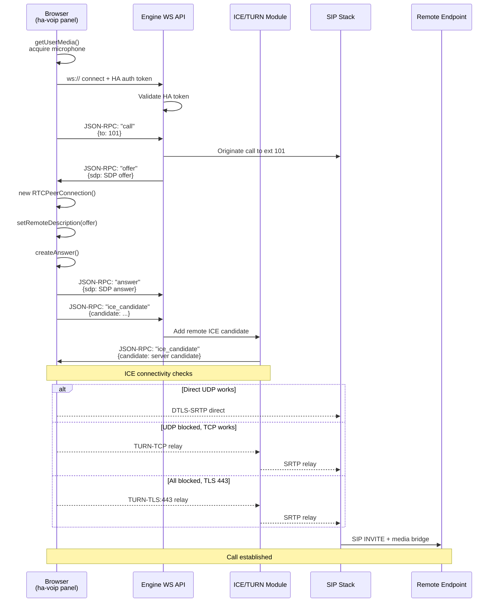
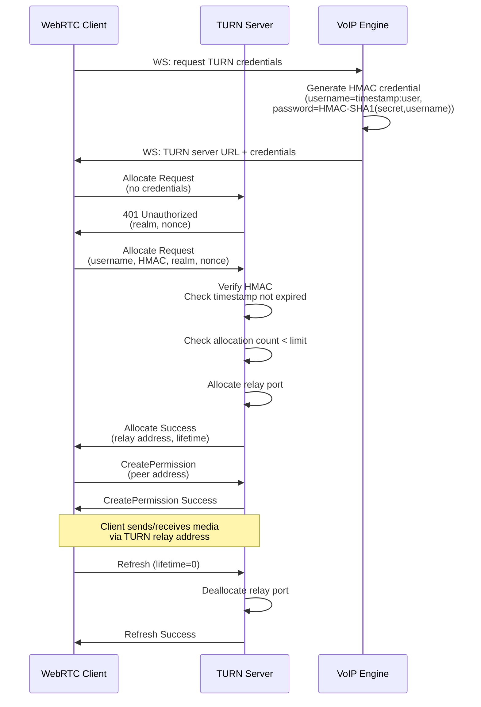
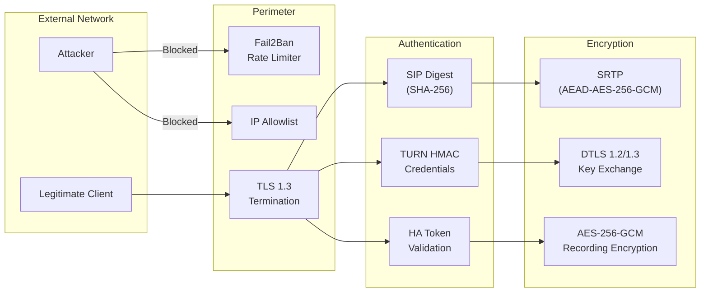

# Architecture

This document describes the internal architecture of ha-voip. It covers every major component, the data flows between them, the NAT traversal strategy, database schema, security architecture, and scalability model.

## System Overview

ha-voip is a monorepo that produces four runtime components plus supporting infrastructure. All four components run on a single Home Assistant host by default, communicating over localhost IPC. The system can also be deployed in a split topology where the VoIP engine and TURN server run on a separate host.

```mermaid
graph TB
    subgraph "Home Assistant Host"
        subgraph "Home Assistant Core"
            HA_INT["HA Integration<br/>(Python custom component)"]
            HA_AUTO["Automations & Scripts"]
            HA_UI["Lovelace Dashboard"]
        end

        subgraph "ha-voip Runtime"
            ENGINE["VoIP Engine<br/>(Rust binary)"]
            TURN["TURN/STUN Server<br/>(embedded in engine)"]
            CERT["Certificate Manager<br/>(embedded in engine)"]
        end

        subgraph "Frontend"
            PANEL["ha-voip Panel<br/>(Lit WebComponent)"]
            WEBRTC["WebRTC Client<br/>(browser JS)"]
        end

        subgraph "Storage"
            DB[(SQLite DB<br/>CDR + config)]
            REC[(Encrypted<br/>Recordings)]
            CERTS_DIR[(TLS Certs)]
        end
    end

    BROWSER["User Browser"] --> PANEL
    PANEL --> WEBRTC
    WEBRTC -- "DTLS-SRTP" --> TURN
    WEBRTC -- "WebSocket<br/>signaling" --> ENGINE
    HA_INT -- "WebSocket<br/>API" --> ENGINE
    HA_AUTO --> HA_INT
    HA_UI --> PANEL
    ENGINE --> DB
    ENGINE --> REC
    CERT --> CERTS_DIR
    ENGINE -- "SIP/TLS" --> TRUNK["SIP Trunk /<br/>PSTN Gateway"]
    TURN -- "SRTP relay" --> ENGINE
    ENGINE --> TURN
    ENGINE --> CERT
```



## Component Descriptions

### VoIP Engine (`voip-engine/`)

The VoIP engine is a standalone Rust binary that implements the core telephony functionality. It is started and supervised by the HA integration as a subprocess (or runs as a separate systemd service / Docker container in split deployments).

**Subcomponents:**

| Module          | Path                        | Responsibility                                                                                  |
|-----------------|-----------------------------|-------------------------------------------------------------------------------------------------|
| SIP Stack       | `voip-engine/src/sip/`      | Full SIP/2.0 implementation: parser, transaction layer (RFC 3261), registrar, proxy logic, dialog management, digest authentication (RFC 8760). |
| Media Engine    | `voip-engine/src/media/`    | RTP/SRTP send and receive, jitter buffer, codec negotiation (Opus, PCMA, PCMU), media mixing for conference calls, DTMF (RFC 4733), VAD, recording pipeline. |
| API Server      | `voip-engine/src/api/`      | REST API for configuration and CDR queries. WebSocket API for real-time events (call state changes, oRTP quality reports) and WebRTC signaling (SDP offer/answer, ICE candidate exchange). |

**Key design decisions:**

- **Rust** was chosen for the engine because VoIP requires deterministic low-latency processing (20 ms RTP packet intervals). Rust's zero-cost abstractions, absence of garbage collection pauses, and memory safety guarantees make it suitable for a long-running media server.
- **Async runtime**: The engine uses `tokio` for network I/O and timer management. Media processing (encode/decode, mixing) runs on a dedicated thread pool to avoid blocking the async executor.
- **SIP parser**: The SIP parser is hand-written (not generated) for performance and fuzz-resistance. It operates on byte slices without heap allocation in the fast path.

### Home Assistant Integration (`integration/`)

The integration is a standard Home Assistant custom component written in Python. It lives in `integration/custom_components/ha_voip/`.

**Responsibilities:**

- **Config flow**: UI-based setup wizard that validates connectivity to the VoIP engine, provisions initial extensions, and stores credentials in HA's credential store.
- **Entity platforms** (`entities/`): Exposes the following entity types:
  - `sensor`: Active call count, extension status (idle/ringing/in-call), TURN allocation count, oRTP quality metrics.
  - `binary_sensor`: Engine health, TLS certificate validity.
  - `switch`: Per-extension Do Not Disturb, call recording toggle.
  - `media_player`: Per-extension call control (answer, hang up, hold, transfer, volume).
- **Services**: `ha_voip.call`, `ha_voip.transfer`, `ha_voip.announce`, `ha_voip.voicemail`, `ha_voip.hangup`, `ha_voip.reload`.
- **Event bus**: Fires `ha_voip_incoming_call`, `ha_voip_call_ended`, `ha_voip_voicemail_received`, `ha_voip_registration_change` events for automation triggers.
- **Translations** (`translations/`): Locale files for English, German, French, Spanish, and additional languages contributed by the community.

**Communication with the engine:**

The integration maintains a persistent WebSocket connection to the engine's API server (`ws://localhost:8266/api/ws`). The WebSocket carries JSON-RPC 2.0 messages for commands (originate call, transfer, hang up) and event subscriptions (call state, oRTP stats). A heartbeat message is sent every 10 seconds; if three consecutive heartbeats are missed, the integration marks the engine as unavailable and attempts reconnection with exponential backoff.

### Frontend Panel (`frontend/`)

The frontend is a Lit-based web component registered as a Home Assistant panel. It is compiled to a single JavaScript bundle placed in `frontend/build/` and served by HA's built-in web server.

**Features:**

- **Dialpad**: Numeric keypad with DTMF tone generation for dialing extensions or PSTN numbers.
- **Call controls**: Answer, hang up, hold, mute, transfer, conference, speaker volume.
- **WebRTC client**: Manages `RTCPeerConnection`, ICE candidate gathering, DTLS-SRTP negotiation, and microphone access. Communicates with the engine via the signaling WebSocket.
- **Call history**: Paginated list of recent calls with duration, direction, and quality indicators.
- **Extension management**: Register/edit/delete extensions, set display names, configure ring groups.
- **Settings**: UI for all configuration options (mirrors `configuration.yaml` entries).

**Technology choice:**

Lit was chosen over React, Vue, or Angular because Home Assistant's own frontend uses Lit and Polymer. Using the same framework ensures visual consistency, access to HA's shared component library (`ha-card`, `ha-icon`, etc.), and smaller bundle size (no duplicate framework code).

### TURN/STUN Server (embedded)

The TURN server is compiled into the VoIP engine binary as a Rust module. It implements:

- **STUN (RFC 5389)**: Binding requests for NAT type detection and server-reflexive candidate gathering.
- **TURN (RFC 5766)**: Relay allocation, permission management, channel binding, and data relay.
- **TURN over TCP and TLS**: For networks that block UDP entirely, the TURN server listens on TCP 3478 and TLS 443.

**Credential mechanism:**

TURN credentials use the time-limited HMAC approach (compatible with coturn's `use_auth_secret` mode). The engine generates a shared secret at startup, rotates it on a configurable interval (default 24 hours), and issues short-lived credentials to WebRTC clients via the signaling WebSocket. Credentials include a Unix timestamp and are valid for twice the rotation interval to allow for clock skew and in-progress sessions.

### Certificate Manager (embedded)

The certificate manager is also compiled into the VoIP engine binary. It handles:

- **ACME (RFC 8555)**: Automated certificate provisioning via Let's Encrypt or any ACME-compliant CA. Supports HTTP-01 (using a temporary listener on port 80) and DNS-01 (via plugin hooks for common DNS providers) challenge types.
- **Self-signed fallback**: For `.local` domains or air-gapped networks, generates a self-signed CA and issues server certificates with correct Subject Alternative Names.
- **Renewal**: A background task checks certificate expiry daily. Renewal is triggered 30 days before expiry. On successful renewal, the SIP TLS listener and TURN TLS listener perform a hot reload of the new certificate without dropping existing connections.
- **File layout**: Certificates and private keys are stored in the configured `cert_path` directory with `0600` permissions. The directory structure is:

```
certs/
  ca.pem                  # Self-signed CA cert (only in self-signed mode)
  ca-key.pem              # Self-signed CA private key
  server.pem              # Server certificate (PEM)
  server-key.pem          # Server private key (PEM)
  server-fullchain.pem    # Full certificate chain
  acme-account.json       # ACME account key (only in ACME mode)
```

## Data Flow Diagrams

### Call Setup (Extension to Extension)



### WebRTC Negotiation (Browser Call)



### TURN Allocation Flow



## NAT Traversal Strategy

ha-voip implements a multi-stage NAT traversal algorithm designed to establish media connectivity in virtually any network environment. The strategy is applied independently for each call leg.

### Port Fallback Algorithm

```
Step 1: Gather candidates
  1a. Host candidates (local IP addresses)
  1b. STUN server-reflexive candidates (public IP via binding request)
  1c. TURN relay candidates (relay address from allocation)

Step 2: ICE connectivity checks (RFC 8445)
  Priority order:
    1. Host <-> Host              (LAN calls, lowest latency)
    2. Host <-> Server-reflexive  (simple NAT, one side)
    3. Server-reflexive <-> Server-reflexive (both behind NAT)
    4. TURN relay                 (fallback, always works)

Step 3: Transport fallback (if UDP fails)
  3a. Retry STUN/TURN over TCP port 3478
  3b. Retry TURN over TLS port 443
      (appears as HTTPS traffic to firewalls)
  3c. If all fail, report ICE failure to the user

Step 4: Nomination
  - Use aggressive nomination for faster call setup
  - Keep-alive via STUN Binding Indications every 15 seconds
  - If the selected pair fails mid-call, ICE restart triggers
    re-negotiation without dropping audio for more than 200ms
```

### NAT Type Detection

On startup and periodically (every 5 minutes), the engine performs NAT type detection using the STUN Binding Request method:

| NAT Type                | Detection Method                              | Traversal Strategy                                  |
|--------------------------|-----------------------------------------------|-----------------------------------------------------|
| No NAT / Public IP       | Binding response IP == local IP               | Direct host candidates                               |
| Full Cone NAT            | Same mapped address for different STUN servers | Server-reflexive candidates work                     |
| Address-Restricted Cone  | Mapped address changes per destination IP      | STUN works after initial outbound packet             |
| Port-Restricted Cone     | Mapped address changes per destination IP:port | STUN works after outbound to exact destination       |
| Symmetric NAT            | Different mapped port per destination          | TURN relay required                                  |

When symmetric NAT is detected on both sides of a call, the engine automatically promotes TURN relay candidates to highest priority, skipping the doomed connectivity checks and reducing call setup time.

### Firewall Compatibility

The TLS 443 fallback is specifically designed for enterprise and hotel networks that only allow outbound HTTPS:

1. The TURN server binds to TCP port 443 with a valid TLS certificate (from the certificate manager).
2. The TLS handshake is a standard TLS 1.3 handshake, indistinguishable from HTTPS to DPI firewalls.
3. After the TLS handshake, the connection carries TURN framing (RFC 6062 TCP allocation).
4. Media is relayed over this single TLS connection, avoiding the need for any additional ports.

## Database Schema Overview

ha-voip uses a single SQLite database stored at `<config_dir>/ha_voip.db`. SQLite was chosen because it requires no external database server, handles the write load of a single-home phone system with ease, and survives unclean shutdowns via WAL mode.

### Tables

```sql
-- Extensions registered in the system
CREATE TABLE extensions (
    id              INTEGER PRIMARY KEY AUTOINCREMENT,
    extension_num   INTEGER NOT NULL UNIQUE,
    display_name    TEXT NOT NULL,
    password_hash   TEXT NOT NULL,           -- Argon2id hash
    enabled         INTEGER NOT NULL DEFAULT 1,
    dnd             INTEGER NOT NULL DEFAULT 0,
    created_at      TEXT NOT NULL DEFAULT (strftime('%Y-%m-%dT%H:%M:%SZ', 'now')),
    updated_at      TEXT NOT NULL DEFAULT (strftime('%Y-%m-%dT%H:%M:%SZ', 'now'))
);

-- SIP registrations (current bindings)
CREATE TABLE registrations (
    id              INTEGER PRIMARY KEY AUTOINCREMENT,
    extension_id    INTEGER NOT NULL REFERENCES extensions(id) ON DELETE CASCADE,
    contact_uri     TEXT NOT NULL,           -- SIP Contact URI
    transport       TEXT NOT NULL,           -- "udp", "tcp", "tls", "ws", "wss"
    user_agent      TEXT,
    source_ip       TEXT NOT NULL,
    source_port     INTEGER NOT NULL,
    expires_at      TEXT NOT NULL,
    registered_at   TEXT NOT NULL DEFAULT (strftime('%Y-%m-%dT%H:%M:%SZ', 'now'))
);

CREATE INDEX idx_registrations_extension ON registrations(extension_id);
CREATE INDEX idx_registrations_expires ON registrations(expires_at);

-- Call Detail Records
CREATE TABLE cdr (
    id              INTEGER PRIMARY KEY AUTOINCREMENT,
    call_id         TEXT NOT NULL UNIQUE,    -- SIP Call-ID
    from_extension  INTEGER,                 -- NULL for trunk inbound
    to_extension    INTEGER,                 -- NULL for trunk outbound
    from_uri        TEXT NOT NULL,
    to_uri          TEXT NOT NULL,
    direction       TEXT NOT NULL,           -- "internal", "inbound", "outbound"
    status          TEXT NOT NULL,           -- "answered", "missed", "busy", "failed"
    started_at      TEXT NOT NULL,
    answered_at     TEXT,
    ended_at        TEXT,
    duration_sec    REAL,
    oRTP_jitter_ms  REAL,                   -- Final oRTP jitter estimate
    oRTP_loss_pct   REAL,                   -- Packet loss percentage
    oRTP_mos        REAL,                   -- Estimated MOS (1.0 - 5.0)
    srtp_profile    TEXT,                   -- e.g. "AEAD_AES_256_GCM"
    recording_path  TEXT,                   -- Path to encrypted recording, if any
    trunk_name      TEXT,                   -- Name of SIP trunk, if applicable
    created_at      TEXT NOT NULL DEFAULT (strftime('%Y-%m-%dT%H:%M:%SZ', 'now'))
);

CREATE INDEX idx_cdr_from ON cdr(from_extension);
CREATE INDEX idx_cdr_to ON cdr(to_extension);
CREATE INDEX idx_cdr_started ON cdr(started_at);
CREATE INDEX idx_cdr_status ON cdr(status);

-- SIP trunk configurations
CREATE TABLE trunks (
    id              INTEGER PRIMARY KEY AUTOINCREMENT,
    name            TEXT NOT NULL UNIQUE,
    host            TEXT NOT NULL,
    port            INTEGER NOT NULL DEFAULT 5060,
    transport       TEXT NOT NULL DEFAULT 'tls',
    username        TEXT,
    password_enc    TEXT,                   -- AES-256-GCM encrypted
    register        INTEGER NOT NULL DEFAULT 1,
    enabled         INTEGER NOT NULL DEFAULT 1,
    codec_priority  TEXT NOT NULL DEFAULT 'opus,pcma,pcmu', -- comma-separated
    inbound_route   TEXT,                   -- e.g. "extension:100" or "ring_group:1"
    created_at      TEXT NOT NULL DEFAULT (strftime('%Y-%m-%dT%H:%M:%SZ', 'now')),
    updated_at      TEXT NOT NULL DEFAULT (strftime('%Y-%m-%dT%H:%M:%SZ', 'now'))
);

-- Ring groups
CREATE TABLE ring_groups (
    id              INTEGER PRIMARY KEY AUTOINCREMENT,
    name            TEXT NOT NULL UNIQUE,
    strategy        TEXT NOT NULL DEFAULT 'ring_all', -- "ring_all", "round_robin", "random"
    ring_timeout    INTEGER NOT NULL DEFAULT 30,
    no_answer_dest  TEXT                    -- e.g. "voicemail:100"
);

CREATE TABLE ring_group_members (
    ring_group_id   INTEGER NOT NULL REFERENCES ring_groups(id) ON DELETE CASCADE,
    extension_id    INTEGER NOT NULL REFERENCES extensions(id) ON DELETE CASCADE,
    priority        INTEGER NOT NULL DEFAULT 0,
    PRIMARY KEY (ring_group_id, extension_id)
);

-- Fail2ban state
CREATE TABLE banned_ips (
    ip_address      TEXT PRIMARY KEY,
    reason          TEXT NOT NULL,          -- "auth_failure", "rate_limit"
    failed_count    INTEGER NOT NULL DEFAULT 1,
    banned_at       TEXT NOT NULL DEFAULT (strftime('%Y-%m-%dT%H:%M:%SZ', 'now')),
    expires_at      TEXT NOT NULL
);

CREATE INDEX idx_banned_expires ON banned_ips(expires_at);

-- Schema version tracking for migrations
CREATE TABLE schema_version (
    version         INTEGER PRIMARY KEY,
    applied_at      TEXT NOT NULL DEFAULT (strftime('%Y-%m-%dT%H:%M:%SZ', 'now')),
    description     TEXT
);
```

### Migration Strategy

Schema migrations live in `migrations/` as sequentially numbered SQL files (`001_initial.sql`, `002_add_ring_groups.sql`, etc.). The engine applies unapplied migrations at startup within a transaction. Rollback scripts are provided alongside each migration for manual recovery.

## Security Architecture



### Defense in Depth Layers

1. **Network layer**: IP allowlisting restricts access to configured CIDR ranges. The fail2ban module bans IPs after repeated authentication failures.
2. **Transport layer**: All signaling uses TLS 1.3 with ECDHE key exchange and AEAD cipher suites (TLS_AES_256_GCM_SHA384, TLS_CHACHA20_POLY1305_SHA256). Older TLS versions are rejected.
3. **Authentication layer**: SIP uses digest authentication with SHA-256 (not MD5). TURN uses time-limited HMAC credentials. The WebSocket API requires a valid Home Assistant long-lived access token.
4. **Media layer**: SRTP with AEAD_AES_256_GCM or AES_256_CM_HMAC_SHA1_80. DTLS key exchange with per-session ECDSA P-256 certificates. Fingerprints are verified against SDP.
5. **Storage layer**: Recordings encrypted with AES-256-GCM, key derived from HA instance secret + per-file nonce. Database passwords hashed with Argon2id. Trunk credentials encrypted at rest.

### Cryptographic Library Choices

| Purpose               | Library                     | Rationale                                                    |
|------------------------|-----------------------------|--------------------------------------------------------------|
| TLS termination        | `rustls` + `ring`           | Pure Rust, no OpenSSL dependency, audited                    |
| SRTP encryption        | `ring` (AES-GCM, HMAC)     | Constant-time, no heap allocation in encrypt/decrypt path    |
| DTLS handshake         | `openssl` (via `tokio-openssl`) | Required for DTLS 1.2 compatibility; `rustls` does not yet support DTLS |
| Password hashing       | `argon2` crate              | Memory-hard, resistant to GPU attacks                        |
| Recording encryption   | `ring` (AES-256-GCM)       | Streaming AEAD with 96-bit nonce, 16-byte tag                |
| ACME client            | `reqwest` + custom ACME     | Lightweight, no external acme-client binary needed           |

## Scalability Model

### Single Node (Default)

The default deployment runs all components on a single Home Assistant host:

```
[ HA Core + Integration ] <-- localhost WS --> [ VoIP Engine (SIP + TURN + Certs) ]
```

**Capacity on a Raspberry Pi 4 (4 GB RAM):**

| Metric                        | Capacity                          |
|-------------------------------|-----------------------------------|
| Concurrent calls              | 10 (Opus), 20 (PCMA/PCMU)        |
| Registered extensions         | 100                               |
| CDR storage (1 year)          | ~50 MB                            |
| Recording storage (1 year)    | Depends on usage; ~1 GB per 100 hours of calls |
| TURN relay bandwidth          | Limited by network uplink          |

**Capacity on a modern x86 server (8 cores, 16 GB RAM):**

| Metric                        | Capacity                          |
|-------------------------------|-----------------------------------|
| Concurrent calls              | 200 (Opus), 500 (PCMA/PCMU)      |
| Registered extensions         | 5,000                             |
| CDR storage (1 year)          | ~500 MB                           |
| TURN relay bandwidth          | Limited by network uplink          |

### Split Deployment

For users who need to isolate the VoIP engine from the HA host (for performance, security, or network architecture reasons):

```
[ HA Host ]                          [ VoIP Host ]
  HA Core + Integration  <-- TLS WS -->  VoIP Engine
  Frontend Panel                          TURN Server
                                          Certificate Manager
```

In this mode:

- The engine's API WebSocket is exposed on a configurable port (default 8266) with mutual TLS authentication.
- The HA integration connects to the engine's hostname/IP instead of localhost.
- The TURN server is accessible directly by browsers, which is the preferred topology for public-facing deployments.

### Federated Model (Multi-Site)

For deployments spanning multiple physical locations (e.g., a main house and a guest house):

```
[ Site A: HA + Engine ]  <-- SIP Trunk (TLS) -->  [ Site B: HA + Engine ]
```

Each site runs its own HA instance and VoIP engine. Inter-site calls are routed via a SIP trunk configured between the two engines. This provides:

- Independent operation if the inter-site link goes down.
- Extension number plan partitioning (e.g., site A uses 1xx, site B uses 2xx).
- Separate TURN servers per site, so media stays local when both parties are on the same site.

## Technology Decisions and Rationale

| Decision                                          | Alternatives Considered         | Rationale                                                                                                                                     |
|---------------------------------------------------|---------------------------------|-----------------------------------------------------------------------------------------------------------------------------------------------|
| **Rust for VoIP engine**                          | C, C++, Go, Python              | VoIP requires sub-millisecond latency and predictable memory use. Rust provides this without garbage collection and with compile-time memory safety. C/C++ were rejected due to the high risk of memory vulnerabilities in a network-facing service. Go was rejected due to GC pauses affecting real-time audio. |
| **Embedded TURN server** (not external coturn)    | coturn, Pion TURN               | Eliminates a separate process and its configuration. Credential management is tightly integrated with the SIP registrar. Single binary simplifies deployment on constrained HA hosts. |
| **SQLite database** (not PostgreSQL/MySQL)        | PostgreSQL, embedded key-value  | A home VoIP system generates modest write traffic (a few CDRs per day). SQLite requires no server, is included in the Rust binary via `rusqlite`, and handles concurrent reads well in WAL mode. |
| **Lit for frontend** (not React/Vue)              | React, Vue, Svelte, vanilla JS  | Home Assistant's dashboard is built on Lit. Using the same framework ensures design consistency, access to HA UI components, and avoids duplicate framework code in the browser. |
| **Python for HA integration** (not Rust/WASM)     | Rust (WASM), JavaScript         | Home Assistant integrations must be Python. The integration is thin (config flow + entity wrappers + WS client) and delegates all heavy lifting to the Rust engine. |
| **WebSocket for engine API** (not REST/gRPC)      | REST polling, gRPC, MQTT        | WebSocket provides bidirectional real-time communication needed for call events and WebRTC signaling. REST would require polling. gRPC adds protobuf complexity. MQTT adds a broker dependency. |
| **ACME for certificates** (not manual certs only) | Manual-only, Certbot            | Automated certificate management removes the most common support burden (expired certificates). Built-in ACME avoids depending on certbot installation and cron configuration. |
| **Opus as primary codec**                         | G.722, G.729, iLBC              | Opus provides wideband audio quality at low bitrates (24 kbps), adapts to network conditions, and is royalty-free. G.729 requires patent licensing. PCMA/PCMU are retained for compatibility with legacy SIP devices. |
| **Argon2id for password hashing**                 | bcrypt, scrypt, PBKDF2          | Argon2id won the Password Hashing Competition and is resistant to both GPU and side-channel attacks. It is the recommended choice for new applications per OWASP guidelines. |
| **`rustls` for TLS** (not OpenSSL)                | OpenSSL, BoringSSL              | `rustls` is a pure-Rust TLS implementation that avoids the large C dependency surface of OpenSSL. It has been independently audited and supports TLS 1.3. OpenSSL is used only for DTLS, which `rustls` does not yet implement. |

## Inter-Component Communication Summary

```
+------------------+          +------------------+          +------------------+
|   HA Integration |          |   VoIP Engine    |          |   Browser Panel  |
|   (Python)       |          |   (Rust)         |          |   (JS/Lit)       |
+--------+---------+          +--------+---------+          +--------+---------+
         |                             |                             |
         | WebSocket (JSON-RPC 2.0)    |                             |
         +---------------------------->|                             |
         |<----------------------------+                             |
         |                             |   WebSocket (JSON-RPC 2.0) |
         |                             |<----------------------------+
         |                             +---------------------------->|
         |                             |                             |
         |                             |   DTLS-SRTP (media)        |
         |                             |<-  -  -  -  -  -  -  -  - >|
         |                             |                             |
         |                             |   SIP/TLS                  |
         |                             |<===========================>|
         |                             |     (external SIP devices)  |
         |                             |                             |
         |                             |   TURN (UDP/TCP/TLS)       |
         |                             |<-  -  -  -  -  -  -  -  - >|
         |                             |     (relay for NATed media) |
+--------+---------+          +--------+---------+          +--------+---------+
|   HA Event Bus   |          |   SQLite DB      |          |   Microphone /   |
|   (internal)     |          |   (file)         |          |   Speaker        |
+------------------+          +------------------+          +------------------+
```

### Message Format (JSON-RPC 2.0)

All WebSocket messages between the integration, engine, and browser follow JSON-RPC 2.0:

**Request:**
```json
{
  "jsonrpc": "2.0",
  "id": 1,
  "method": "call.originate",
  "params": {
    "from_extension": 100,
    "to_extension": 101,
    "announcement": null
  }
}
```

**Response:**
```json
{
  "jsonrpc": "2.0",
  "id": 1,
  "result": {
    "call_id": "a1b2c3d4-e5f6-7890-abcd-ef1234567890",
    "status": "ringing"
  }
}
```

**Event (server-initiated notification):**
```json
{
  "jsonrpc": "2.0",
  "method": "event.call_state",
  "params": {
    "call_id": "a1b2c3d4-e5f6-7890-abcd-ef1234567890",
    "state": "established",
    "from_extension": 100,
    "to_extension": 101,
    "started_at": "2025-01-15T10:30:00Z",
    "srtp_profile": "AEAD_AES_256_GCM"
  }
}
```

## Monitoring and Observability

### Prometheus Metrics Endpoint

The VoIP engine exposes a `/metrics` endpoint (default port 9100) in Prometheus exposition format. Key metrics:

| Metric                                | Type      | Description                                   |
|---------------------------------------|-----------|-----------------------------------------------|
| `havoip_calls_active`                 | Gauge     | Number of currently active calls              |
| `havoip_calls_total`                  | Counter   | Total calls since engine start                |
| `havoip_calls_failed_total`           | Counter   | Total failed call attempts                    |
| `havoip_registrations_active`         | Gauge     | Number of active SIP registrations            |
| `havoip_oRTP_jitter_ms`              | Histogram | oRTP jitter distribution across calls         |
| `havoip_oRTP_packet_loss_ratio`      | Histogram | Packet loss ratio distribution                |
| `havoip_oRTP_mos`                    | Histogram | Estimated MOS score distribution              |
| `havoip_srtp_negotiation_failures`   | Counter   | SRTP negotiation failure count                |
| `havoip_auth_failures_total`         | Counter   | Authentication failure count (by type)        |
| `havoip_banned_ips_active`           | Gauge     | Number of currently banned IP addresses       |
| `havoip_turn_allocations_active`     | Gauge     | Number of active TURN allocations             |
| `havoip_turn_bandwidth_bytes`        | Counter   | Total bytes relayed through TURN              |
| `havoip_tls_cert_expiry_seconds`     | Gauge     | Seconds until TLS certificate expiry          |
| `havoip_engine_uptime_seconds`       | Gauge     | Engine process uptime                         |

### Grafana Dashboards

Pre-built dashboards in `monitoring/grafana/` provide:

- **Call Quality Overview**: Active calls, MOS distribution, jitter and loss time series.
- **Security Dashboard**: Auth failure rate, banned IPs, SRTP negotiation success rate, certificate expiry countdown.
- **TURN Server Dashboard**: Active allocations, bandwidth usage, credential rotation status.
- **Engine Health**: CPU usage, memory usage, open file descriptors, uptime.

### Structured Logging

The engine emits structured JSON logs to stderr (captured by systemd/Docker). Log levels follow the standard hierarchy (TRACE, DEBUG, INFO, WARN, ERROR). Security-relevant events are always logged at WARN or above with a `security_event: true` field for easy filtering.
